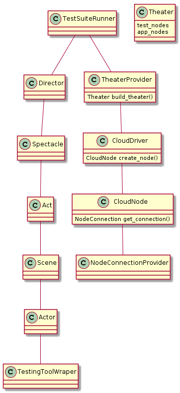

# reefperf - tool for cloud performace measurement

Main purpose of project is creation a tool that allows do a perforamce tests
and get readable raport from them across many cloud vendors (maybe compare them).

# Draft

## High level idea (basic use-case in following steps):

1. Deploy (with nodes creation) app on given cloud using reefperf interface. 
	Here reefperf needs some assumption about tested app deployment (for consideration)
2. Create nodes for app testing and put on them test scripts. 
	Design of these test scripts (for consideration)
3. Run test scripts simultaneously.
4. Gather infromation form test nodes.
5. Prepare report from test

## Architecture (except module for raport generator)

Note: In following descirption pattern means a pattern of simulated users load.
	Example: continuous high load, low load with short high load peaks etc.

Classes responsibilities:
- TheaterProvider - orders to build cloud infrastructure for whole reefperf test
- Theater - represents all app nodes as well as test nodes, orders reconfiguration of test nodes
- NodeConnctionProvider - provide connection (eg. ssh), that allows put and run some script on given node
- CloudNode - represents a node in cloud, with connection interface, separate class for each cloud vendor
- CloudDriver - creates node on cloud, separate class for each cloud vendor
- Director - deploys app on app_nodes, deploys test scripts on test_nodes, configures all nodes, runs a spectacle
- Spectacle - starts a series of acts (called a scenario - scenario simulates one weighted pattern mix), collects results
- Act - runs multiple scenes (in parallel or sequentially or hybrid) 
- Scene - executes a series of actors (in parallel or sequentially or hybrid).
	One scene is one test machine running some pattern (or multiple patterns)
- Actor - executes (sequentially?) a list of lines on a given scene (lines ~> series of TestingToolWrapper objects).
	Actor is assigned to single scene
- TestingToolWrapper - wrapper for testing tools such as ab, httpperf, jmeter
	with uniform interface across all its subclasses which allows information gathering from testing tool execution.
	It is basic element which realises load pattern.

## Useful links
[libcloud](https://libcloud.apache.org/)
[jclouds](https://jclouds.apache.org/)
